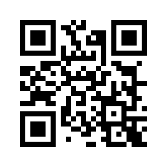
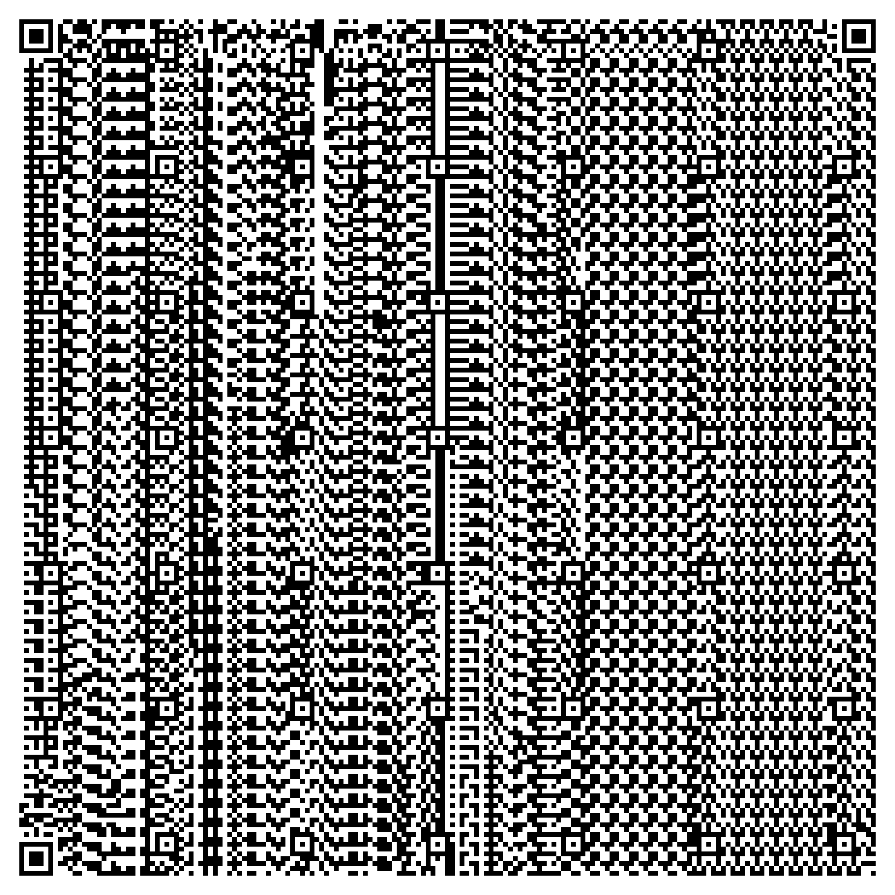
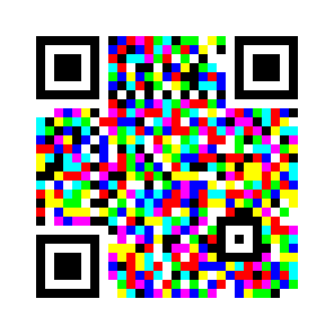
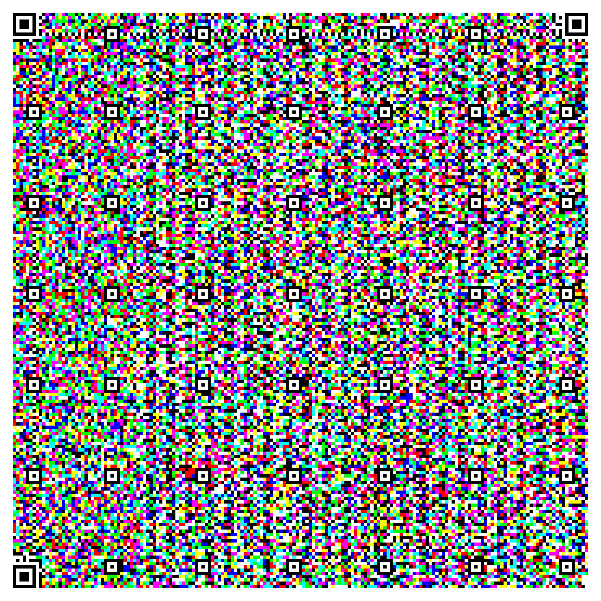

# ColoredQRCode

ColoredQRCode is a Python library for generating and decoding standard, colored, and intensity-modulated (IM) QR codes. It supports high data density and robust decoding, even after lossy compression (e.g., JPEG). The library is compatible with Python 3.9+ and uses only standard and widely available Python packages.

## Features

- Generate standard black-and-white QR codes
- Generate colored QR codes (RGB channels encode more data)
- Generate intensity-modulated (IM) colored QR codes (even higher data density)
- Decode all supported QR code types
- Robust to JPEG compression and re-encoding

## Installation

Install dependencies (preferably in a virtual environment):

```sh
pip install -r requirements.txt
```

## Usage

### Generate a Standard QR Code

```python
from coloredqrcode import generate_qr_code
from qrcode.constants import ERROR_CORRECT_L, ERROR_CORRECT_M, ERROR_CORRECT_Q, ERROR_CORRECT_H

img = generate_qr_code("Hello, QR!", output_path="qrcode.png")
img.show()  # Display the QR code

# Advanced: Specify error correction level directly using qrcode constants
img = generate_qr_code(
    "Hello, QR! (M level)",
    output_path="qrcode_m.png",
    error_correction=ERROR_CORRECT_M
)
img.show()
```

### Decode a Standard QR Code

```python
from coloredqrcode import decode_qr_code

# Accepts file path, PIL.Image.Image, or numpy.ndarray as input
# Example with file path:
data = decode_qr_code("qrcode.png")
print(data)  # Output: Hello, QR!

# Example with PIL Image:
from PIL import Image
img = Image.open("qrcode.png")
data = decode_qr_code(img)
print(data)
```

### Generate a Colored QR Code (RGB)

```python
from coloredqrcode import generate_colored_qr_code

data = "The quick brown fox jumps over the lazy dog 1234567890!@#"
img = generate_colored_qr_code(data, output_path="colored_qr.png")
img.show()
```

### Decode a Colored QR Code

```python
from coloredqrcode import decode_colored_qr_code

# Accepts file path, PIL.Image.Image, or numpy.ndarray as input
# Example with file path:
decoded = decode_colored_qr_code("colored_qr.png")
print(decoded)

# Example with PIL Image:
from PIL import Image
img = Image.open("colored_qr.png")
decoded = decode_colored_qr_code(img)
print(decoded)
```

### Generate an Intensity-Modulated (IM) Colored QR Code

```python
from coloredqrcode import generate_colored_qr_code_im

data = "A long string to encode with high density..."
img = generate_colored_qr_code_im(data, output_path="colored_qr_im.png")
img.show()
```

### Decode an Intensity-Modulated (IM) Colored QR Code

```python
from coloredqrcode import decode_colored_qr_code_im

# Accepts file path, PIL.Image.Image, or numpy.ndarray as input
# Example with file path:
decoded = decode_colored_qr_code_im("colored_qr_im.png")
print(decoded)

# Example with PIL Image:
from PIL import Image
img = Image.open("colored_qr_im.png")
decoded = decode_colored_qr_code_im(img)
print(decoded)
```

## Example Output

Below are example outputs generated by ColoredQRCode:

| Type                      | Example                                                      | Description |
|---------------------------|--------------------------------------------------------------|-------------|
| Standard QR Code          |                    | Standard QR, data: 10 bytes ("Hello, QR!"), max: 2953 bytes (L) |
| Standard QR (Max Data)    |                  | Standard QR, max data: 2953 bytes (L) |
| Colored QR Code (RGB)     |                  | Colored QR (RGB), data: 62 bytes, max: 8859 bytes (L) |
| Colored QR (Max Data)     |                | Colored QR (RGB), max data: 8859 bytes (L) |
| IM Colored QR Code        |            | IM Colored QR, data: 62 bytes, max: 17718 bytes (L) |
| IM Colored QR (Max Data)  |          | IM Colored QR, max data: 17718 bytes (L) |

---

## Supported Data Lengths

| QR Code Type         | Max Data Length (Error Correction L) |
|---------------------|:-------------------------------------:|
| Standard QR         | 2953 bytes                            |
| Colored QR (RGB)    | 8859 bytes                            |
| IM Colored QR       | 17718 bytes                           |

*Note: Maximum data length decreases with higher error correction levels (M, Q, H). The values above are for level L (lowest error correction, highest capacity).*

---

## Error Handling

If the input data is too long for the selected QR code type or error correction level, a `QRCodeDataTooLongError` is raised.

## Requirements

- Python 3.9+
- See `requirements.txt` for dependencies (qrcode, Pillow, pyzbar, opencv-python)

## Testing

Run all tests with:

```sh
.venv/bin/python -m pytest
```

## License

This project is licensed under the MIT License. See the [LICENSE](LICENSE) file for details.
